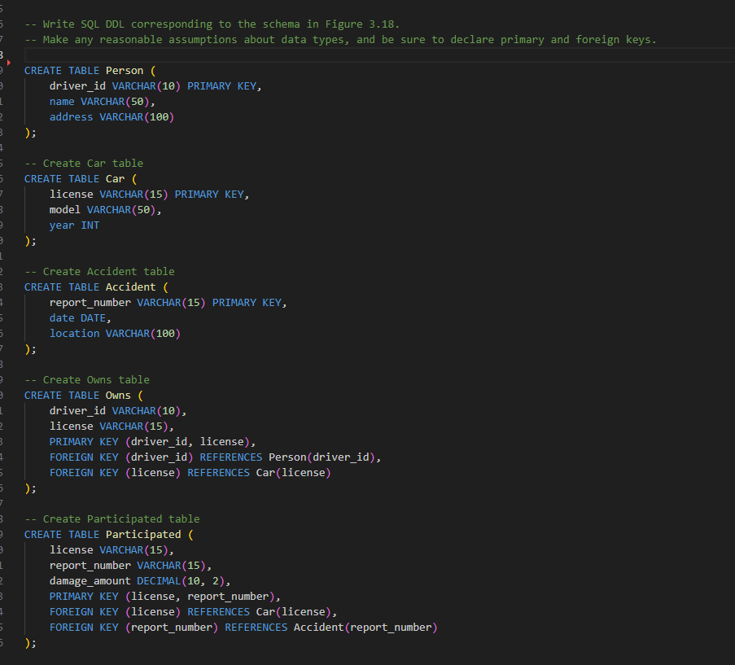

# DSC-E3.13

Write SQL DDL corresponding to the schema in Figure 3.18.
Make any reasonable assumptions about data types, and be sure to declare primary and foreign keys.

Person (driver_id, name, address)
Car (license, model, year)
Accident (report_number, date, location)
Owns (driver_id, license)
Participated (license, report_number, damage_amount)

